### Swagger快速入门

### Swagger常用注解

### 解决日期格式问题
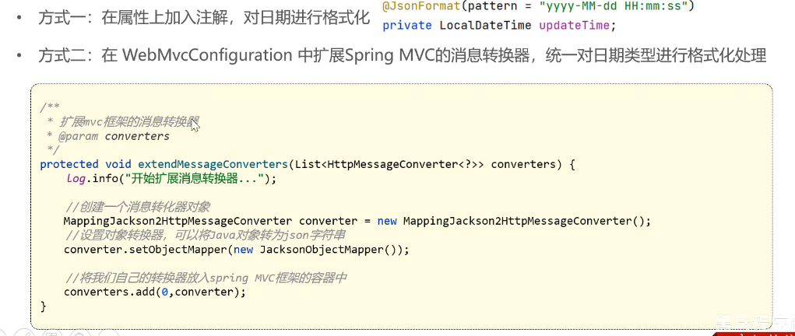
### 公共字段自动赋值
* 实现思路: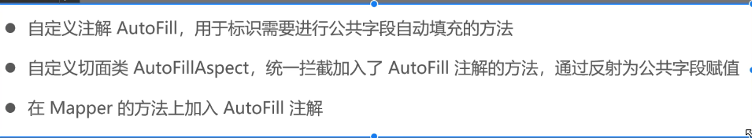
### 阿里云OSS使用
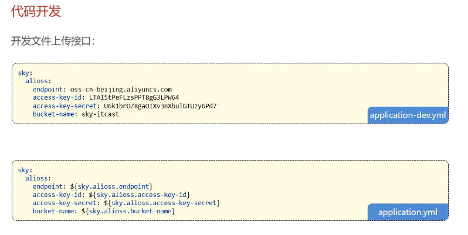
### Redis使用
* Redis简介：基于内存的key-value结构数据库，读写性能高，存储热点数据
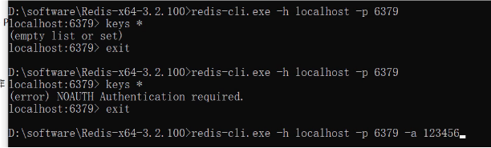
* 常用数据类型: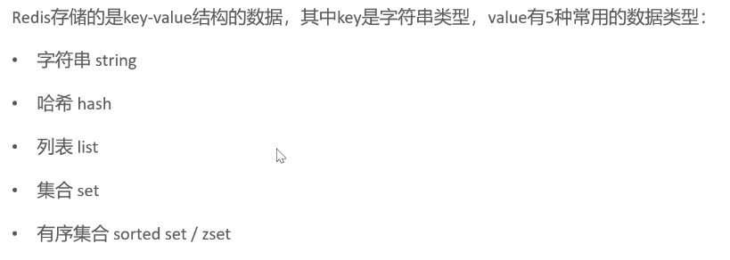
  * string: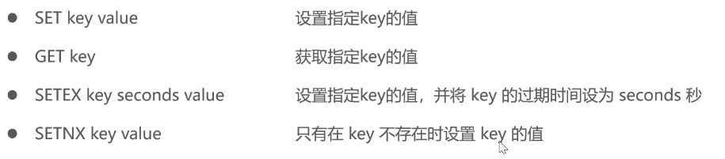
  * map: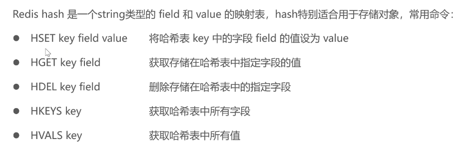
  * list: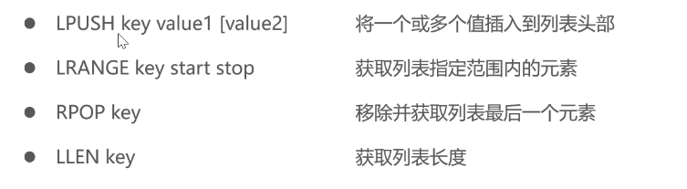
  * set: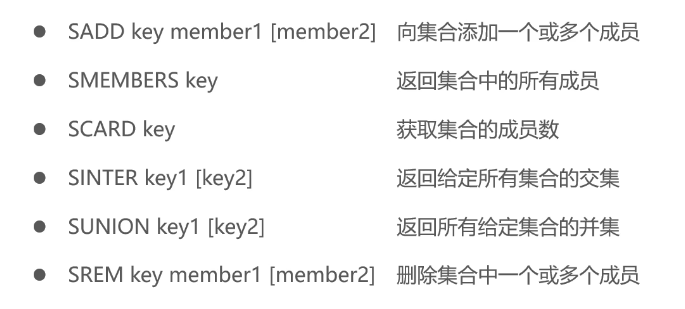
  * 有序set: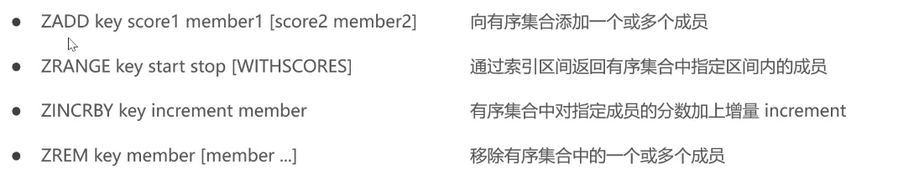
  * 通用命令: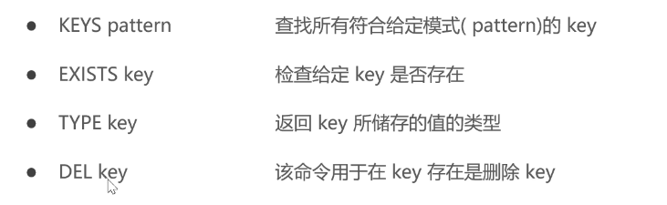
* 在java中操作redis(Spring data Redis):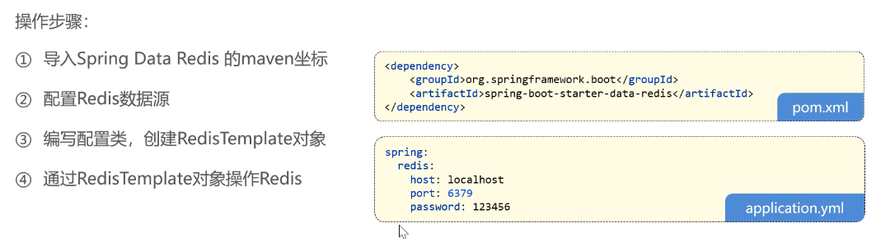
### HTTPClient
* 简介：HTTP协议的客户端编程工具包
* 微信小程序开发：
  * 准备工作：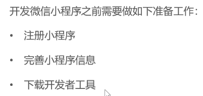
### Spring Cache
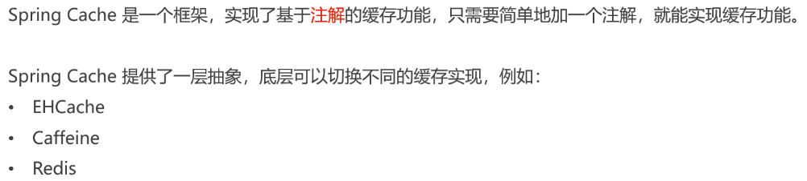
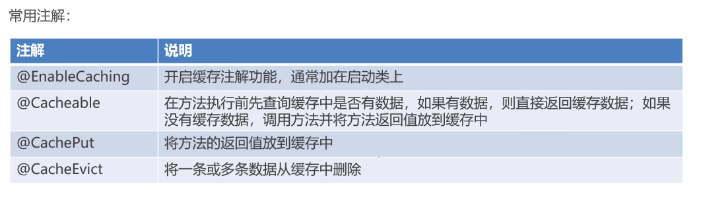
* 使用步骤：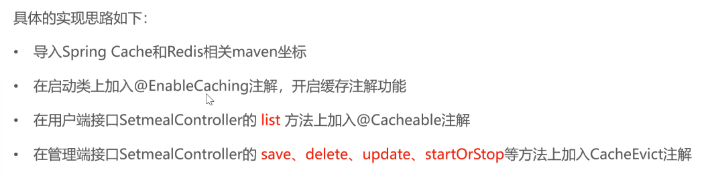
